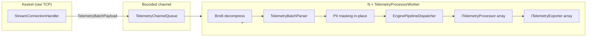
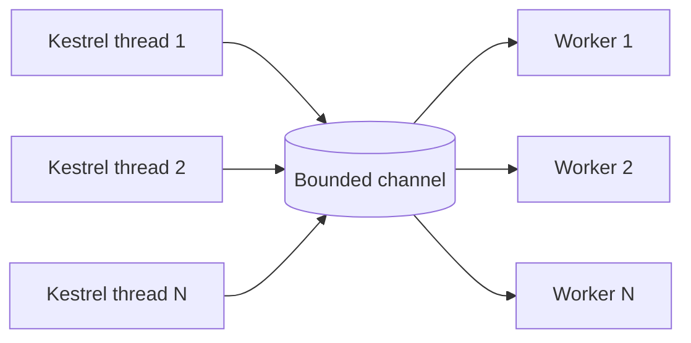

# Architecture

This document describes the internal design of InfraStream: the pipeline,
the key components, and the reasoning behind the main design decisions.

For a quick overview, see the root [`README.md`](../README.md). For what's
planned, see [`Roadmap.md`](../Roadmap.md).

---

## Overview

InfraStream is an **edge gateway for telemetry**: it receives log batches
from many nodes over raw TCP, validates them, masks PII, parses JSON, and
forwards them to one or more exporters.

It is not a general-purpose log shipper. It is a **focused ingress
component**, designed to be embedded into an existing .NET application, run
as a sidecar, or deployed standalone.

### Design goals

1. **Zero allocations on the hot path.** Parsing, validation, and masking
   must not allocate managed objects per item.
2. **UTF-8 end-to-end.** No UTF-16 conversions during parsing.
3. **Backpressure by default.** When downstream is slow, the gateway must
   apply backpressure — not buffer without limit.
4. **Small footprint.** A single CPU core must be enough for meaningful
   throughput.
5. **Native .NET integration.** `ILogger`, DI, `IOptions`, `Span<T>`.

### Non-goals

- General-purpose log processing (filtering, transforms, plugins).
- Multi-tenancy with authentication (planned for Phase 5).
- Persistent buffering on disk (planned for Phase 5).

---

## Pipeline

**Flow:**

1. **Ingress.** Kestrel accepts a raw TCP connection. `StreamConnectionHandler`
   parses HTTP/1.1 headers, extracts `X-Node-Id`, `X-Environment`,
   `Content-Encoding`, and reads the request body into a pooled buffer.
2. **Queue.** The body is wrapped in a `TelemetryBatchPayload` (rented from
   `TelemetryBatchPool`) and pushed into a bounded channel
   (`TelemetryChannelQueue`). If the channel is full, backpressure is
   applied via the TCP window.
3. **Workers.** N `TelemetryProcessorWorker` instances (one per CPU core, or
   configured) read payloads from the channel. Each worker:
  - Decompresses the payload with Brotli if it is compressed.
  - Parses JSON with `Utf8JsonReader` (`TelemetryBatchParser`).
  - Masks PII **in place** in the source buffer (`TelemetryMasker`).
  - Dispatches each item to the configured processors and exporters
    (`EnginePipelineDispatcher`).
4. **Export.** Each `ITelemetryExporter` receives items synchronously via
   `ExportItem(in TelemetryItem)`. Real exporters are expected to buffer
   internally and flush periodically via `Flush()`.
5. **Return.** After the worker finishes the batch, the payload is returned
   to the pool (`TelemetryBatchPool.Return`) and the array to
   `ArrayPool<byte>`.

---

## Components

### `InfraStream.Core` — models and interfaces

| Type | Purpose |
|------|---------|
| `TelemetryItem` | A single log line. All string-like fields are `ReadOnlyMemory<byte>` (UTF-8). |
| `LogAttribute` | Key-value pair, UTF-8. |
| `ITelemetryExporter` | Sink contract. `ExportItem(in TelemetryItem)` + `Flush()`. |
| `ITelemetryProcessor` | Filter/processor contract. `Process(ref LogProcessingContext)`. |
| `LogProcessingContext` | Mutable context passed to processors (`ref struct`). |
| `NullExporter` | No-op sink. Used for benchmarks. |
| `ConsoleExporter` | Prints items to the console. Dev/troubleshooting only. |
| `OpenTelemetryExporter` | Stub. Phase 5. |
| `KafkaExporter` | Stub. Phase 5. |

### `InfraStream.CollectorEngine` — the pipeline

| Type | Purpose |
|------|---------|
| `StreamConnectionHandler` | Kestrel `ConnectionHandler`. Parses HTTP/1.1, reads body into pooled buffer. |
| `TelemetryChannelQueue` | Bounded channel between Kestrel and workers. Provides backpressure. |
| `TelemetryBatchPayload` | Pooled container for a batch. |
| `TelemetryBatchPool` | Lock-free pool of `TelemetryBatchPayload` instances. |
| `TelemetryProcessorWorker` | Background worker. Decompresses, parses, dispatches. |
| `TelemetryWorkerHost` | Wraps a worker as an `IHostedService`. |
| `TelemetryBatchParser` | Zero-allocation JSON parser using `Utf8JsonReader`. |
| `MessageInterner` | Static cache for well-known tokens (log levels, component names). |
| `EnginePipelineDispatcher` | Runs processors, then exporters. |
| `ITelemetryItemConsumer` | Contract for the parser's sink. |
| `TelemetryMasker` | In-place PII masking. |
| `InfraStreamOptions` | Configuration model. |
| `CollectorEngineExtensions` | `AddCollectorEngine()` entry point. |
| `ExporterExtensions` | Fluent exporter registration. |
| `LoggingExtensions` | Dev/Prod logging setup. |

---

## Key design decisions

### 1. Zero allocations on the hot path

Every parsed item allocates **nothing**. This is achieved by:

- **`Utf8JsonReader`** — reads directly from a `ReadOnlySpan<byte>` without
  materializing strings.
- **`ReadOnlyMemory<byte>` slices** — `TelemetryItem` fields point **into
  the batch buffer**, not into copies.
- **`ArrayPool<byte>`** — buffers for decompression are rented and returned.
- **`TelemetryBatchPool`** — payload objects are reused.
- **`MessageInterner`** — well-known tokens (e.g. `INFO`, `nginx`) are
  returned from a static cache, not allocated.

**Why it matters:** the GC is the biggest enemy of throughput in .NET
services under high load. Eliminating allocations eliminates GC pauses.

### 2. UTF-8 end-to-end

The entire pipeline works with UTF-8 bytes. Conversion to `string` happens
**only** inside exporters that need it (e.g. `ConsoleExporter`).

**Why it matters:** UTF-16 ↔ UTF-8 conversions are expensive and allocate.
Keeping everything in UTF-8 removes the cost.

### 3. In-place PII masking

`TelemetryMasker.MaskInPlace` modifies the batch buffer **directly**:
- Replaces bytes with `*` at the right positions.
- Does not copy the message.
- Does not allocate.

**Why it matters:** masking is applied on the hot path. A copy-based
implementation would allocate per item — defeating goal #1.

**Trade-off:** because masking mutates the source buffer, the
`rawJsonSlice` field of `TelemetryItem` contains **already-masked** data.
Consumers that expect pristine JSON must be aware of this.

### 4. Ownership contract

`TelemetryItem` contains `ReadOnlyMemory<byte>` values that point **into the
batch buffer**. The buffer is returned to the pool as soon as `ExportItem`
returns.

**The contract:**
- Read the bytes **synchronously**.
- Do **not** retain references.
- **Copy** if you need the data later.

This is documented in `ITelemetryExporter` and `LogAttribute` and enforced
by API shape (`in TelemetryItem`).

**Why it matters:** it makes the zero-allocation design possible. Without
this contract, every item would need to own its own copy of the data.

### 5. Backpressure via bounded channel

`TelemetryChannelQueue` is a `BoundedChannel<TelemetryBatchPayload>` with
`FullMode = BoundedChannelFullMode.Wait`.

When the channel is full:
- Kestrel threads **wait** asynchronously in `WriteAsync`.
- The kernel **shrinks the TCP window**.
- Producers (edge nodes) are throttled by TCP itself.

**Why it matters:** without backpressure, a slow downstream would cause
unbounded memory growth. With backpressure, the gateway applies **flow
control** at the network layer — no queues explode, no OOM.

### 6. Parallel workers

Each `TelemetryProcessorWorker` runs on its own task. The number of workers
is `Environment.ProcessorCount` by default, or the value of
`InfraStream__WorkerCount`.

**Why it matters:** parsing and masking are CPU-bound. Running N workers on
N cores gives near-linear scaling (see benchmarks in the README).

### 7. No metrics in the hot path

`TelemetryProcessorWorker` does **not** use `Stopwatch`, `Process`, or
per-item counters in the hot loop. Metrics are aggregated **per batch** and
logged **only when the worker stops**.

**Why it matters:** per-item timing or counting would allocate, branch, and
pollute the cache — a measurable cost at 7M lines/s.

Uptime and rate metrics are expected to come from **host metrics**
(Prometheus / OpenTelemetry), not from the gateway itself (Phase 5).

---

## Concurrency model

- **Many writers** — Kestrel threads, one per connection.
- **Several readers** — N workers, one per CPU core.
- **Single bounded channel** — no per-connection queues.

**Why single channel:** it gives a **single point of backpressure**. If a
worker is stuck, the channel fills, and **all** Kestrel threads experience
backpressure equally.

---

## Memory model

| Buffer | Owner | Lifetime | Pool |
|--------|-------|----------|------|
| Request body | `TelemetryBatchPayload.Array` | From rent to `Dispose` | `ArrayPool<byte>` + `TelemetryBatchPool` |
| Decompressed body | Worker-local `decompressedBuffer` | Worker lifetime | `ArrayPool<byte>` (rented once per worker) |
| Attribute array | `TelemetryBatchParser` | Per-batch | `ArrayPool<LogAttribute>` |
| Interned tokens | `MessageInterner` | Process lifetime | Static |
| JSON slices | `TelemetryItem` fields | Until `ExportItem` returns | Point into batch buffer |

---

## What is NOT in the hot path

- **Logging** — aggregated, logged on worker stop.
- **Metrics** — expected from host (Prometheus / OTel), not from the gateway.
- **String conversions** — only in exporters that need them.
- **Allocations** — none per item (see above).

---

## Trade-offs and known limits

- **Escaped JSON strings** skip masking and allocate (rare in practice).
- **`DecompressedBufferSize = 16 MB`** is hardcoded. Very large batches
  may fail to decompress.
- **`MessageInterner`** only knows a fixed set of tokens. Extending to a
  dynamic cache is future work.
- **Real exporters** will add copy, serialization, and network cost.
- **No graceful shutdown yet.** In-flight batches may be dropped on
  termination. Planned for Phase 5.

See [`Roadmap.md`](../Roadmap.md) §Known limitations for the full list of
current limitations, and Phase 5 for planned work.

---

## See also

- [`README.md`](../README.md) — overview and quick start.
- [`Roadmap.md`](../Roadmap.md) — planned phases and known limitations.
- [`examples/`](../examples/) — runnable examples.
- [`CONTRIBUTING.md`](../CONTRIBUTING.md) — how to contribute.
